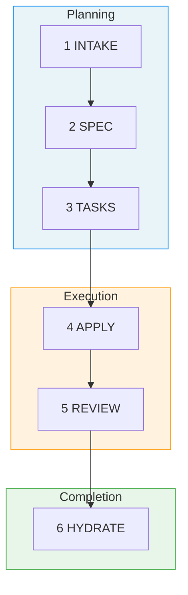

# Fab Kit

A structured development workflow for AI agents. You describe a change, AI plans it, implements it, reviews it, and saves what it learned into shared project memory. Each completed change builds shared context, so future changes start with better knowledge.

Fab Kit is a 6-stage pipeline defined entirely in markdown prompts — no SDK, no vendor lock-in. The skills are plain prompts any AI agent can execute (Claude Code, Codex, Cursor, Windsurf). Copy it into your project and go.

> **[Try it now](#quick-start)** | **[Understand the concepts](#why-fab-kit)**

**Contents:** [The 6 Stages](#the-6-stages) · [Prerequisites](#prerequisites) · [Quick Start](#quick-start) · [Why Fab Kit](#why-fab-kit) · [Commands](#command-quick-reference) · [Updating](#updating) · [Learn More](#learn-more)

## The 6 Stages

Every change (a self-contained feature or fix with its own folder) moves through six stages:



| # | Stage | Purpose | Artifact |
|---|-------|---------|----------|
| 1 | **Intake** | Capture intent, scope, approach | `intake.md` |
| 2 | **Spec** | Define requirements | `spec.md` |
| 3 | **Tasks** | Break into implementation checklist | `tasks.md` + `checklist.md` |
| 4 | **Apply** | Execute the tasks | Code changes |
| 5 | **Review** | Validate against spec and constitution | Validation report |
| 6 | **Hydrate** | Save learnings into project memory | Memory updates |

Each stage produces a persistent artifact. Interrupt anything — `/fab-continue` picks up from the last checkpoint.

### Self-correction built in

When review finds problems, it loops back to the right stage instead of just reporting failures:

| Review finds | Loops back to | What happens |
|-------------|---------------|--------------|
| Implementation bug | → apply | Unchecks failed tasks, re-runs them |
| Missing/wrong tasks | → tasks | Revises tasks, re-applies |
| Requirements were wrong | → spec | Updates spec, regenerates tasks |

`/fab-fff` (full fast-forward) handles rework autonomously — up to 3 cycles before escalating to you.

A change folder looks like this:

```
fab/current/add-spinner/
├── intake.md        # What you want and why
├── spec.md          # Requirements (generated)
├── tasks.md         # Implementation plan (generated)
├── checklist.md     # Progress tracking
└── .status.yaml     # Pipeline state
```

## Prerequisites

Install with [Homebrew](https://brew.sh/) (macOS and Linux):

```bash
brew install yq gh bats-core direnv
```

| Tool | Purpose |
|------|---------|
| [yq](https://github.com/mikefarah/yq) | YAML processing for status files and schemas |
| [gh](https://cli.github.com/) | GitHub CLI — used for installation and releases |
| [bats-core](https://github.com/bats-core/bats-core) | Bash test runner for kit validation |
| [direnv](https://direnv.net/) | Auto-loads `.envrc` to put fab scripts on PATH |

After installing `gh`, authenticate with `gh auth login`.

## Quick Start

### 1. Install

**From GitHub releases** (requires [gh CLI](https://cli.github.com/) with authentication):

```bash
mkdir -p fab
gh release download --repo wvrdz/fab-kit --pattern 'kit.tar.gz' --output - | tar xz -C fab/
```

Or from a local clone:

```bash
cp -r /path/to/fab-kit/fab/.kit ./fab/
```

### 2. Initialize

**In your terminal:**

```bash
fab/.kit/scripts/fab-sync.sh            # creates directories, symlinks, .gitignore
direnv allow                            # approve .envrc (adds scripts to PATH)
# No direnv? export PATH="$PWD/fab/.kit/scripts:$PATH"
```

**Then in your AI agent:**

```
/fab-setup    # Claude Code
$fab-setup    # Codex
```

This generates `fab/config.yaml`, `fab/constitution.md` (your project's architectural rules), and `docs/memory/`.

### 3. Your first change

```
/fab-new Add a loading spinner to the submit button
```

#### Creation

1. Agent creates `intake.md` — captures intent, asks clarifying questions

#### Planning (run `/fab-continue` after each)

2. Generates `spec.md` — structured requirements
3. Generates `tasks.md` — implementation checklist

#### Execution

4. Agent implements the code, checking off tasks as it goes
5. Reviews the implementation against the spec

#### Completion

6. Saves learnings into `docs/memory/`, then archives the change

At any point, run `/fab-status` to see where you are.

For small changes, `/fab-ff` (fast-forward) skips intermediate planning stages. For trivial changes, `/fab-fff` (full fast-forward) runs the entire pipeline autonomously.

### 4. Going parallel

While AI works on one change, start another in a separate [git worktree](https://git-scm.com/docs/git-worktree) (an isolated copy of your repo):

```
/fab-new Add error toast for failed submissions
/fab-switch add-error-toast
```

Each change is a self-contained folder — multiple AI sessions run in parallel without conflicts. [How the assembly line works →](docs/specs/assembly-line.md)

### Troubleshooting

- `direnv allow` doesn't work — reload your shell or run `eval "$(direnv export zsh)"`
- `/fab-setup` not recognized — verify `.claude/skills/` has symlinks to `fab/.kit/skills/`

## Why Fab Kit

### Parallel by Default

<!-- Diagram: Traditional one-at-a-time workflow vs assembly line. In the traditional approach, you and AI alternate between working and idle. In the assembly line, you create batches of changes while AI executes previous batches — both stay busy. -->
```
  ██ = working    ░░ = idle

              One at a time
              ─────────────

  You    ██░░░░░░░░██░░░░░░░░██░░░░░░░░██░░░░░░░░
  AI     ░░████████░░████████░░████████░░████████

  Create, wait, review. Create, wait, review.
  More waiting than working.


              Assembly line
              ─────────────

  You    ██████░░█████████░██░█████████░██░░░░░░░
  AI     ░░░░░░██████████░████████████░░████████░

  Create a batch, hand off, create the next batch.
  Both always working.
```

Without Fab, you describe a task, wait while AI works, review, repeat. With Fab, you batch structured changes — each in its own folder and worktree — and create the next batch while AI executes the current one.

Three properties make this work:

- **Self-contained change folders** — Each change has its own spec, tasks, and status. No shared state — parallel changes don't interfere during development.
- **Git worktree isolation** — Each change runs in its own [worktree](https://git-scm.com/docs/git-worktree). Parallel AI sessions can't step on each other.
- **Resumable pipeline** — Every stage produces a persistent artifact. Interrupt anything, resume later.

### Shared Memory That Grows With Your Project

Most AI tools give each session a private memory that disappears when the session ends. Fab saves learnings from every completed change into `docs/memory/` — a domain-organized knowledge base committed to git and shared with the entire team.

```
  ┌──────────┐    hydrate     ┌──────────────┐
  │ spec.md  │ ─────────────▶ │ docs/memory/ │
  └──────────┘                └──────┬───────┘
       ▲                             │
       │       context for next      │
       └──────── change ─────────────┘
```

This creates a self-reinforcing cycle:

- **Every change makes the next one better** — Design decisions from `spec.md` merge into memory. Future changes load those files as context, so AI starts with real knowledge of your system instead of guessing.
- **Team knowledge, not personal notes** — Memory lives in git. Every developer and every AI session reads the same source of truth. Onboarding means cloning the repo.
- **Bootstrap from existing docs** — `/docs-hydrate-memory` ingests documentation from Notion, Linear, or local files. The pipeline keeps it current from there.
- **Structured, not append-only** — Memory is organized by domain (`auth/`, `payments/`, `users/`). `/docs-reorg-memory` restructures as it grows. `/docs-hydrate-specs` updates spec files with relevant details from memory.

## Command Quick Reference

> **Prefix:** Use `/fab-*` in Claude Code, `$fab-*` in Codex.

| Command | Purpose |
|---------|---------|
| `/fab-setup` | Bootstrap fab/ structure, manage config/constitution, apply migrations |
| `/fab-new <description>` | Start a new change |
| `/fab-continue` | Advance to next stage |
| `/fab-ff` | Fast-forward planning stages |
| `/fab-fff` | Full autonomous pipeline with rework |
| `/fab-clarify` | Deepen current artifact before moving on |
| `/fab-status` | Check current progress |
| `/fab-switch` | Switch active change |
| `/fab-archive` | Archive a completed change |
| `/docs-hydrate-memory [sources...]` | Ingest external docs into memory |

## Updating

```bash
fab-upgrade.sh       # downloads latest kit, replaces fab/.kit/, repairs symlinks
```

If the upgrade reports a version mismatch, run `/fab-setup migrations` in your AI agent to apply migrations. Safe to re-run.

To repair symlinks and scaffold structure without downloading a new release (useful when developing fab-kit itself):

```bash
bash fab/.kit/scripts/fab-sync.sh
```

## Learn More

- **[The Assembly Line](docs/specs/assembly-line.md)** — batch scripts, Gantt charts, and the full numbers behind parallel development
- **[Design & Workflow Details](docs/specs/overview.md)** — principles, detailed stage descriptions, example workflows
- **[User Flow Diagrams](docs/specs/user-flow.md)** — visual maps of the full pipeline, shortcuts, rework paths, and state machine
- **[Full Command Reference](docs/specs/skills.md)** — detailed behavior for every `/fab-*` skill
- **[Glossary](docs/specs/glossary.md)** — all Fab terminology defined
- **[Contributing](CONTRIBUTING.md)** — developing, extending, and releasing Fab Kit
