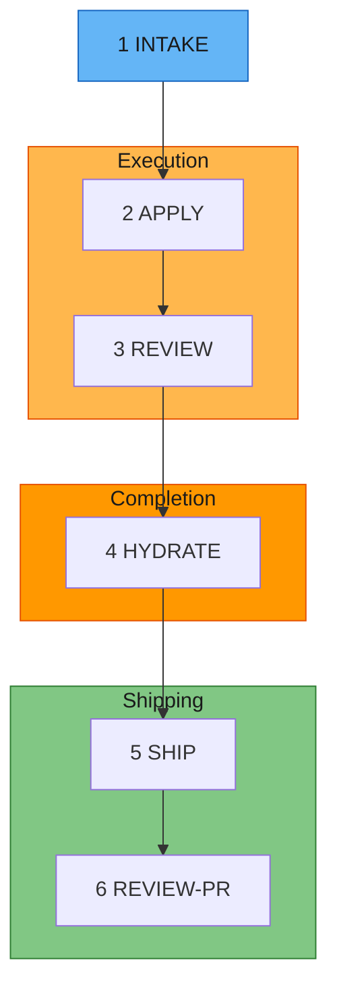

# Fab Kit

> Part of [@sahil87's open source toolkit](https://shll.ai) — see all projects there.

[](https://github.com/sahil87/fab-kit/releases) [](https://github.com/sahil87/fab-kit/releases) [](https://github.com/sahil87/fab-kit/stargazers)

A development toolkit for AI-assisted coding. It includes a 6-stage pipeline (intake → apply → review → hydrate → ship → review-PR), standalone CLI tools for [git worktree management](https://github.com/sahil87/fab-kit/blob/main/docs/specs/companions.md) (`wt`) and [idea backlogs](https://github.com/sahil87/fab-kit/blob/main/docs/specs/companions.md) (`idea`), and batch orchestration for running multiple AI agents in parallel. Plain markdown prompts, no SDK, no vendor lock-in. Works with Claude Code, Codex, Cursor, and Windsurf.

AI agents write code fast. The bottleneck is now your clarity: did you define the problem well enough? Fab Kit sits at that bottleneck — it forces structured thinking before implementation, grounds every session in your project's actual context, and gets cheaper to run as agents improve.

> **[Try it now](#quick-start)** | **[Understand the concepts](#why-fab-kit)** | **[Install guide](docs/site/install.md)** | **[Workflows guide](docs/site/workflows.md)** | **[Glossary](https://github.com/sahil87/fab-kit/blob/main/docs/specs/glossary.md)** (new to Fab terminology?)

**Contents:** [The 6 Stages](#the-6-stages) · [Prerequisites](#prerequisites) · [Quick Start](#quick-start) · [Why Fab Kit](#why-fab-kit) · [The 5 Cs](#the-5-cs-of-quality) · [Commands](#command-quick-reference)

## Install

```sh
curl -fsSL https://shll.ai/install | sh -s -- fab-kit
```

Installs fab-kit (plus the shll meta-CLI) via Homebrew, handling tap trust automatically. To install the entire sahil87 toolkit instead:

```sh
curl -fsSL https://shll.ai/install | sh
```

## The 6 Stages

Every change (a self-contained feature or fix with its own folder) moves through six stages:


<details>
<summary>Mermaid source</summary>



</details>

| # | Stage | Purpose | Artifact |
|---|-------|---------|----------|
| 1 | **Intake** | Capture intent, scope, approach | `intake.md` |
| 2 | **Apply** | Co-generate `plan.md` (requirements + tasks + acceptance) from intake, then execute the tasks | `plan.md` + code changes |
| 3 | **Review** | Sub-agent validates against the plan's requirements and [constitution](#code-quality-as-a-guardrail) (your project's architectural rules) | Prioritized findings report |
| 4 | **Hydrate** | Save learnings into project memory (`docs/memory/`) | Memory updates |
| 5 | **Ship** | Commit, push, and create a GitHub PR | Pull request |
| 6 | **Review-PR** | Triage and fix PR review comments from humans or automated reviewers | Comments addressed |

Each stage produces a persistent artifact or state update. Interrupt anything — re-run the same command to resume. All pipeline skills are idempotent.

Review is performed by a **sub-agent** running in a separate context - a fresh perspective that validates against both the plan's requirements and your [project constitution](#code-quality-as-a-guardrail). Findings are prioritized (must-fix, should-fix, nice-to-have) and the agent triages them, looping back for automatic rework on the issues that matter most.

A change folder looks like this:

```
fab/changes/260101-abcd-add-spinner/
├── intake.md        # What you want and why
├── plan.md          # Requirements + tasks + acceptance (generated at apply entry)
└── .status.yaml     # Pipeline state (symlinked as .fab-status.yaml at repo root while this change is active)
```

## Prerequisites

> 📦 For the full, tool-specific install walkthrough — companion utilities, shell completion, and the new-project / existing-repo / upgrade flows — see the **[Install guide](docs/site/install.md)**.

### Using Fab Kit

See [Install](#install) above. You'll also need a few utilities fab depends on:

```bash
brew install yq jq gh direnv
```

* After installing `gh`, authenticate with `gh auth login`.
* After installing `direnv`, add the hook [to your shell](https://direnv.net/docs/hook.html).
* Optional — activate shell completion in your shell's rc file:

  ```bash
  eval "$(fab shell-init zsh)"   # or bash / fish
  ```

  Works from any directory (no fab project required). Prefer saving the script to disk? Use `fab completion <shell>` instead.

| Tool | Purpose |
|------|---------|
| [fab-kit](https://github.com/sahil87/fab-kit) | The `fab` CLI router, workspace lifecycle (`init`/`upgrade-repo`/`sync`), `wt`, and `idea` |
| [yq](https://github.com/mikefarah/yq) | YAML processing for status files and schemas |
| [jq](https://jqlang.github.io/jq/) | JSON processing for settings merge during sync |
| [gh](https://cli.github.com/) | GitHub CLI - used for releases and PR workflows |
| [direnv](https://direnv.net/) | Auto-loads `.envrc` to set workspace environment variables |

### Developing Fab Kit

In addition to the above:

```bash
brew install go just
```

| Tool | Purpose |
|------|---------|
| [Go](https://go.dev/) | Required for building binaries from source (`src/go/`) |
| [just](https://just.systems/) | Task runner for build, test, and release recipes |

## Quick Start

### 1. Install

#### New project

```bash
fab init
```

This downloads the latest release to the system cache, sets `fab_version` in `fab/project/config.yaml`, and runs `fab sync` to deploy skills — all in one step. No curl scripts or manual downloads.

**Then in your AI agent:**

```
/fab-setup    # Claude Code
$fab-setup    # Codex
```

This generates `fab/project/constitution.md` and other project configuration files. Run `fab doctor` to verify your setup.

Once setup completes, run `/fab-discuss` to load project context and orient before your first change.

#### Onboarding an existing repo with prior docs

If your project already has documentation (Notion pages, Linear specs, READMEs, design docs), bootstrap memory from them before your first change:

1. **Initialize the repo:**

   ```bash
   fab init        # new to Fab Kit
   fab sync        # cloning a repo that already uses Fab Kit
   ```

2. **In your AI agent — set up project config:**

   ```
   /fab-setup
   ```

3. **Hydrate memory from your existing docs** (or from the codebase itself):

   ```
   /docs-hydrate-memory <notion-url> <linear-url> ./README.md ./docs/
   /docs-hydrate-memory                 # no args → generate from codebase analysis
   ```

   Accepts Notion/Linear URLs, local `.md` files, or folder paths. Safe to re-run — content is merged, not overwritten.

4. **Propagate memory into structured specs:**

   ```
   /docs-hydrate-specs
   ```

   This flows memory → specs (the reverse of `hydrate`), surfacing gaps where memory covers a topic that specs don't. Top gaps are previewed for confirmation.

5. **Orient before your first change:**

   ```
   /fab-discuss
   ```

#### Updating from a previous version

Two steps — one in the terminal, one in your AI agent:

1. **In your terminal** — bump the kit version and re-sync:

   ```bash
   fab upgrade-repo              # upgrades to latest version
   fab upgrade-repo 0.44.0       # upgrades to a specific version
   ```

   `fab upgrade-repo` tells you whether step 2 is needed. If a data migration is pending, the output ends with a highlighted line — `Run '/fab-setup migrations' to update project files` — and **that** step runs in your AI agent, not the terminal. No highlighted line means you're already up to date: skip step 2.

   

2. **In your AI agent** (only if step 1 flagged a migration) — apply it:

   ```
   /fab-setup migrations    # Claude Code
   $fab-setup migrations    # Codex
   ```

   Safe to re-run — no-op if no migrations are pending.

   

To re-deploy skills, scaffold structure, and sync hooks without changing the pinned version (useful after cloning):

```bash
fab sync
```

> **Note:** `fab sync` runs automatically in every new worktree created by [`wt create`](https://github.com/sahil87/fab-kit/blob/main/docs/specs/companions.md#wt--worktree-isolation).

### 2. Your first change

> 🛠️ For a task-oriented walkthrough of driving the pipeline — the per-stage command sequence, the apply⇄review auto-rework loop, `/fab-ff` vs `/fab-fff` vs `/fab-proceed`, and going parallel with worktrees — see the **[Workflows guide](docs/site/workflows.md)**.

Fab Kit skills are slash commands you type into an AI agent's chat, not the terminal. Open a session in your project directory:

- **Claude Code:** `claude` in terminal
- **Codex:** `codex` in terminal
- **Cursor / Windsurf:** open the project, use the chat panel

Then type the commands below in the agent's prompt. Each command runs one pipeline stage — the AI generates output in real time, so wait for it to finish before running the next.

```bash
# In your AI agent:

# Creation - creates change folder, writes intake.md, activates the change, creates git branch
/fab-new Add a loading spinner to the submit button

# Apply - generates plan.md (requirements + tasks + acceptance) and implements the code, checking off tasks as it goes
/fab-continue
# Review - reviews implementation against the plan's requirements + constitution
/fab-continue
# Hydrate - saves learnings into docs/memory/
/fab-continue

# Ship - commit, push, and create a GitHub PR
/git-pr
# Review-PR - triage and fix PR review comments
/git-pr-review

# Archive - move the change folder out of active changes
/fab-archive
```

At any point, run `/fab-status` to see where you are.

For small changes, `/fab-ff` (fast-forward) runs the pipeline through hydrate in one shot - gated by a single intake [confidence score](#structured-autonomy-not-guesswork) that ensures ambiguity is low enough for safe execution. Both `/fab-ff` and `/fab-fff` (full fast-forward) auto-loop between apply and sub-agent review, fixing issues automatically before escalating to you.

### 3. Going parallel

While AI works on one change, start another in a separate [git worktree](https://git-scm.com/docs/git-worktree) (an isolated copy of your repo):

```bash
# In your terminal:
wt create                # creates an isolated worktree with a random name

# In a new AI agent session in that worktree:
/fab-new Add error toast for failed submissions
```

Each change is a self-contained folder - multiple AI sessions run in parallel without conflicts. `/fab-new` auto-activates, so you can start working immediately. Use `/fab-draft` to queue a change without switching to it. [How the assembly line works →](https://github.com/sahil87/fab-kit/blob/main/docs/specs/assembly-line.md)

### Troubleshooting

Run `fab doctor` to check all prerequisites (git, yq, direnv hook, etc.) and diagnose common setup issues.

- `direnv allow` doesn't work - reload your shell or run `eval "$(direnv export zsh)"`
- `/fab-setup` not recognized - re-run `fab sync` to deploy skills
- **After cloning a repo that uses Fab Kit** - run `fab sync` once. Agent skills and hooks live in `.claude/` which is gitignored by default, so each developer needs to deploy them locally.
- **A stage fails mid-way** - run `/fab-continue` to resume from the last checkpoint. All stage artifacts are persisted, so no progress is lost.
- **AI produces bad code** - the review sub-agent catches it. `/fab-ff` and `/fab-fff` auto-loop between apply and review (up to 3 cycles) before escalating to you.
- **Abandon a change** - delete the change folder, or run `/fab-archive` to move it to the archive.
- **You built something without Fab and opened a PR** - run `/fab-adopt` on the branch to bring it into the pipeline mid-flight. It reconstructs the intake and plan from the diff, runs review and hydrate (so `docs/memory/` stays the source of truth), and retro-fits the PR's `## Meta` block — only `apply` is marked skipped, since the code already exists.

## Why Fab Kit

AI coding tools give you speed but leave you to manage quality and knowledge yourself. Fab Kit gives you all four:

| [**Speed**](#parallel-by-default) | [**Knowledge**](#shared-memory-that-grows-with-your-project) | [**Quality**](#code-quality-as-a-guardrail) | [**Autonomy**](#structured-autonomy-not-guesswork) |
|:---:|:---:|:---:|:---:|
| Parallel changes - never idle | Compounds with every change | Constitution + self-correcting review | Confidence-scored - assumes or asks based on context |

### Parallel by Default

<!-- Diagram: Traditional one-at-a-time workflow vs assembly line. In the traditional approach, you and AI alternate between working and idle. In the assembly line, you create batches of changes while AI executes previous batches - both stay busy. -->
```
  ██ = working    ░░ = idle

              One at a time
              ─────────────

  You    ██░░░░░░░░██░░░░░░░░██░░░░░░░░██░░░░░░░░
  AI     ░░████████░░████████░░████████░░████████

  Create, wait, review. Create, wait, review.
  More waiting than working.


              Assembly line
              ─────────────

  You    ██████░░█████████░██░█████████░██░░░░░░░
  AI     ░░░░░░██████████░████████████░░████████░

  Create a batch, hand off, create the next batch.
  Both always working.
```

Without Fab, you describe a task, wait while AI works, review, repeat. With Fab, you batch structured changes - each in its own folder and worktree - and create the next batch while AI executes the current one.

Three properties make this work:

- **Self-contained change folders** - Each change has its own intake, plan, and status. No shared state - parallel changes don't interfere during development.
- **Git worktree isolation** - Each change runs in its own [worktree](https://git-scm.com/docs/git-worktree). Parallel AI sessions can't step on each other.
- **Resumable pipeline** - Every stage produces a persistent artifact. Interrupt anything, resume later.

### Shared Memory That Grows With Your Project

Most AI tools give each session a private memory that disappears when the session ends. Fab saves learnings from every completed change into `docs/memory/` - a domain-organized knowledge base committed to git and shared with the entire team.

```
  ┌──────────┐    hydrate     ┌──────────────┐
  │ plan.md  │ ─────────────▶ │ docs/memory/ │
  └──────────┘                └──────┬───────┘
       ▲                             │
       │       context for next      │
       └──────── change ─────────────┘
```

This creates a self-reinforcing cycle:

- **Every change makes the next one better** - Design decisions from `plan.md` merge into memory. Future changes load those files as context, so AI starts with real knowledge of your system instead of guessing.
- **Team knowledge, not personal notes** - Memory lives in git. Every developer and every AI session reads the same source of truth. Onboarding means cloning the repo.
- **Bootstrap from existing docs** - `/docs-hydrate-memory` ingests documentation from Notion, Linear, or local files. The pipeline keeps it current from there.
- **Structured, not append-only** - Memory is organized by domain (`auth/`, `payments/`, `users/`). `/docs-reorg-memory` restructures as it grows. `/docs-hydrate-specs` updates spec files with relevant details from memory.

### Code Quality as a Guardrail

AI writes code fast. Without structure, it also skips requirements, ignores architectural conventions, and ships the first thing that works. Fab enforces quality through structure, a constitution, and self-correcting review.

```
        ┌───────────────────────────────┐
        │  fab/project/constitution.md  │
        │    MUST · SHOULD · MUST NOT   │
        └───────────────┬───────────────┘
                        │
  intake → apply ⇄ review → hydrate
             ↑       ↗
             └───────┘
          sub-agent review
          with prioritized
          findings
```

- **Stages that can't be skipped** - The pipeline requires intake before any code is written. The AI can't jump straight to implementation. Before code is written, the [SRAD framework](#structured-autonomy-not-guesswork) ensures planning decisions are grounded in context - not silently guessed.
- **Project constitution** - `fab/project/constitution.md` defines your architectural rules using MUST/SHOULD/MUST NOT. Every plan and review checks against it - not just the change's requirements.
- **Review that fixes, not just flags** - A **sub-agent** reviews in a fresh context, returning prioritized findings. The applying agent triages by severity and loops back to the right stage:

| Review finds | Priority | Loops back to | What happens |
|-------------|----------|---------------|--------------|
| Requirement mismatch, failing tests | Must-fix | → apply | Unchecks failed tasks in `plan.md`, re-runs them |
| Missing/wrong tasks | Must-fix | → apply | Regenerates `plan.md`, re-applies |
| Requirements were wrong | Must-fix | → apply | Updates `plan.md`'s `## Requirements`, regenerates tasks |
| Code quality issue | Should-fix | → apply | Addressed when clear and low-effort |
| Style suggestion | Nice-to-have | - | May be skipped |

`/fab-fff` and `/fab-ff` auto-loop between apply and review (up to 3 cycles) - each re-review uses a fresh sub-agent. `/fab-ff` falls back to interactive rework after exhausting auto-retries. A typical `/fab-fff` run uses 2-4 agent turns per stage; the sub-agent review spawns a separate context.

#### The 5 Cs of Quality

Five configuration files shape how AI works in your project. Each answers a different question:

| C | File | Question |
|---|------|----------|
| **Constitution** | `fab/project/constitution.md` | What are our non-negotiable principles? |
| **Context** | `fab/project/context.md` | What are we working with? |
| **Code Quality** | `fab/project/code-quality.md` | How should code look when we write it? |
| **Code Review** | `fab/project/code-review.md` | What should we look for when we validate? |
| **Config** | `fab/project/config.yaml` | What are the project's factual settings? |

Notice the author-vs-critic split: `code-quality.md` guides the **writing** agent during apply - coding standards, anti-patterns, test strategy. `code-review.md` guides the **reviewing** sub-agent during review - severity definitions, scope boundaries, rework budget. Different cognitive modes, different concerns, different files.

All five are optional except `constitution.md` and `config.yaml`. They live in `fab/project/`. Run `/fab-setup` to generate them from scaffolds with sensible defaults. For the full `config.yaml` schema — every available option, documented — run `fab config reference`.

### Structured Autonomy, Not Guesswork

AI tools either ask too many questions or silently assume. Fab uses **SRAD** - a 4-dimension framework - to decide which to do for each decision point during planning.

**S**ignal strength · **R**eversibility · **A**gent competence · **D**isambiguation type

Each dimension scores how safe it is to assume. The scores aggregate into a confidence grade:

| Grade | What happens |
|-------|-------------|
| **Certain** | Proceeds silently - deterministic from config/codebase |
| **Confident** | Proceeds, noted in assumptions summary |
| **Tentative** | Proceeds with marker - resolvable via `/fab-clarify` |
| **Unresolved** | Blocks and asks - too ambiguous to guess |

Grades aggregate into a **confidence score** that gates `/fab-ff`. If ambiguity is too high, the pipeline refuses to run and tells you what to clarify - no silent guesswork, no unnecessary interruption. [How SRAD works →](https://github.com/sahil87/fab-kit/blob/main/docs/specs/srad.md)

## Command Quick Reference

> **Prefix:** Use `/fab-*` in Claude Code, `$fab-*` in Codex.

> 📖 The tables below are a quick reference. For the full, auto-generated command reference — every subcommand, flag, and usage string — see **[shll.ai/tools/fab-kit/commands](https://shll.ai/tools/fab-kit/commands/)**.

### Pipeline

| Command | Purpose |
|---------|---------|
| `/fab-new <description>` | Start a new change — creates the intake, activates it, and creates the git branch |
| `/fab-draft <description>` | Create a change intake without activating it (queue for later) |
| `/fab-continue` | Advance to the next stage (or reset to a specific stage) |
| `/fab-ff` | Fast-forward through hydrate — confidence-gated, auto-rework loop |
| `/fab-fff` | Fast-forward further through ship + PR review — same gates as ff |
| `/fab-clarify` | Refine the current artifact — resolve gaps without advancing |
| `/fab-adopt` | Adopt an off-pipeline change — reconstruct intake + plan from an open PR's branch diff, then run review, hydrate, and PR decoration retroactively |
| `/fab-archive` | Archive a completed change (or restore an archived one) |
| `/fab-proceed` | Context-aware orchestrator — detects state, runs setup steps, then delegates to `/fab-fff` |

### Setup & Status

| Command | Purpose |
|---------|---------|
| `/fab-setup` | Bootstrap fab/ structure, manage config/constitution, apply migrations |
| `/fab-status` | Show current change state — name, branch, stage, checklist, next command |
| `/fab-switch` | Switch active change (or list available changes) |
| `/fab-help` | Show workflow overview and command summary |
| `/fab-discuss` | Load project context for an exploratory discussion session |

### Git

| Command | Purpose |
|---------|---------|
| `/git-branch` | Create or switch to the git branch matching the active change |
| `/git-pr` | Commit, push, and create a GitHub PR |
| `/git-pr-review` | Process PR review comments — triage and fix feedback |

### Documentation

| Command | Purpose |
|---------|---------|
| `/docs-hydrate-memory [sources...]` | Ingest external docs or generate memory from codebase analysis |
| `/docs-hydrate-specs` | Detect gaps between memory and specs, propose additions |
| `/docs-reorg-memory` | Analyze memory files for themes, suggest reorganization |
| `/docs-reorg-specs` | Analyze spec files for themes, suggest reorganization |

### Multi-Agent Coordination

The operator (`/fab-operator`) is a long-running coordination layer that sits in its own tmux pane, observing and directing agents across other panes. It is optional and useful when running multiple agent sessions simultaneously.

| Command | Purpose |
|---------|---------|
| `/fab-operator` | Multi-agent coordination — monitoring, auto-answering, autopilot queues, dependency-aware spawning |

[Operator version history →](https://github.com/sahil87/fab-kit/blob/main/docs/specs/operator.md)

### CLI Subcommands

| Command | Purpose |
|---------|---------|
| `fab sync` | Repair symlinks, scaffold structure, deploy skills |
| `fab config reference` | Print the fully-commented reference config.yaml — every available option |
| `fab doctor` | Diagnose common setup issues |
| `fab fab-help` | Print workflow overview to terminal |
| `fab operator` | Launch operator in a dedicated tmux tab |
| `fab batch new` | Create worktree tabs from backlog items |
| `fab batch switch` | Open tmux tabs in worktrees for one or more changes |
| `fab batch archive` | Archive multiple completed changes in one session |

## Stage Coverage by Command

Which pipeline stages each command covers. Taller bars = more automation. Read left-to-right from most manual to most automated. **▶** marks typical entry points — start with `/fab-discuss` (exploratory) or `/fab-new` (ready to build). Arrows show the typical path from idea to PR. Dashed borders indicate optional/utility stages. Empty cells = not covered by that command.

| Color | Category | Commands |
|-------|----------|----------|
| 🟦 Cyan | Explore (read-only) | `/fab-discuss` |
| 🟧 Amber | Manual (single action) | `/fab-draft`, `/fab-switch`, `/fab-continue` |
| ⬜ Blue-grey (dashed) | Git utilities | `/git-branch`, `/git-pr`, `/git-pr-review` |
| 🟩 Green | Automated pipeline (multi-stage) | `/fab-new`, `/fab-ff`, `/fab-fff`, `/fab-proceed`, `/fab-adopt` |
| ◻️ Grey | Fab pipeline stage (row label) | intake, change active, apply, review, hydrate |
| ▶ | Typical entry point | `/fab-discuss`, `/fab-new` |

![Stage coverage by command: a matrix of pipeline stages (rows) by command (columns), color-coded — cyan Explore, amber Manual, blue-grey dashed Git utilities, green Automated pipeline, hatched grey Stage skipped. fab-discuss covers context; fab-draft intake; fab-switch change active; git-branch branch name; fab-new intake/change active/branch name; fab-continue, fab-ff, fab-fff, fab-proceed each cover apply/review/hydrate; fab-fff and fab-proceed also ship and review-pr; git-pr ship; git-pr-review review-pr; fab-adopt enters mid-flight covering intake/review/hydrate/ship/review-pr with apply skipped](https://raw.githubusercontent.com/sahil87/fab-kit/main/docs/img/stage-coverage.svg)

> `/fab-adopt` (rightmost column) enters the pipeline mid-flight on an existing branch/PR: it reconstructs intake from the diff and skips `apply` since the code already exists.

```mermaid
block-beta
    columns 14

    hdr_label["wt create →"]:1 hdr_discuss["▶ /fab-discuss"] hdr_draft["/fab-draft"] hdr_switch["/fab-switch"] hdr_branch["/git-branch"] hdr_new["▶ /fab-new"] hdr_continue["/fab-continue"] hdr_ff["/fab-ff"] hdr_gitpr["/git-pr"] hdr_gitprreview["/git-pr-review"] hdr_fff["/fab-fff"] hdr_proceed["/fab-proceed"] hdr_adopt["/fab-adopt"] space:1

    space:14

    row_ctx["context"]:1 discuss_ctx["project context"]:1 space:12
    row_intake["intake"]:1 space:1 draft_intake["intake"]:1 space:2 new_intake["intake"]:1 space:5 proceed_intake["intake"]:1 adopt_intake["from diff"]:1 space:1
    row_active["change active"]:1 space:2 switch_active["change active"]:1 space:1 new_active["change active"]:1 space:5 proceed_active["change active"]:1 space:2
    row_branch["branch name"]:1 space:3 branch_branch["branch name"]:1 new_branch["branch name"]:1 space:5 proceed_branch["branch name"]:1 space:2
    row_apply["apply"]:1 space:5 cont_apply["one stage"]:1 ff_apply["apply"]:1 space:2 fff_apply["apply"]:1 proceed_apply["apply"]:1 adopt_apply["skipped"]:1 space:1
    row_review["review"]:1 space:5 cont_review["one stage"]:1 ff_review["review"]:1 space:2 fff_review["review"]:1 proceed_review["review"]:1 adopt_review["review"]:1 space:1
    row_hydrate["hydrate"]:1 space:5 cont_hydrate["one stage"]:1 ff_hydrate["hydrate"]:1 space:2 fff_hydrate["hydrate"]:1 proceed_hydrate["hydrate"]:1 adopt_hydrate["hydrate"]:1 space:1
    row_ship["ship"]:1 space:5 space:1 space:1 gitpr_ship["PR raised"]:1 space:1 fff_ship["PR raised"]:1 proceed_ship["PR raised"]:1 adopt_ship["PR meta"]:1 space:1
    row_prreview["review-pr"]:1 space:5 space:1 space:1 space:1 gitprreview_prreview["PR reviewed"]:1 fff_prreview["PR reviewed"]:1 proceed_prreview["PR reviewed"]:1 adopt_prreview["PR reviewed"]:1 space:1

    %% Arrows — multiple paths from top-left to bottom-right
    discuss_ctx --> draft_intake
    discuss_ctx --> new_intake
    discuss_ctx --> proceed_intake
    draft_intake --> switch_active
    switch_active --> branch_branch
    new_branch --> cont_apply
    new_branch --> ff_apply
    new_branch --> fff_apply
    ff_hydrate --> gitpr_ship

    %% Header styles
    style hdr_label fill:none,stroke:none,color:#999
    style hdr_discuss fill:#4dd0e1,stroke:#00838f,color:#1a1a1a
    style hdr_draft fill:#ffb74d,stroke:#E65100,color:#1a1a1a
    style hdr_switch fill:#ffb74d,stroke:#E65100,color:#1a1a1a
    style hdr_new fill:#81c784,stroke:#2E7D32,color:#1a1a1a
    style hdr_branch fill:#b0bec5,stroke:#546e7a,color:#1a1a1a,stroke-dasharray: 5 5
    style hdr_continue fill:#ffb74d,stroke:#E65100,color:#1a1a1a
    style hdr_ff fill:#81c784,stroke:#2E7D32,color:#1a1a1a
    style hdr_gitpr fill:#b0bec5,stroke:#546e7a,color:#1a1a1a,stroke-dasharray: 5 5
    style hdr_gitprreview fill:#b0bec5,stroke:#546e7a,color:#1a1a1a,stroke-dasharray: 5 5
    style hdr_fff fill:#81c784,stroke:#2E7D32,color:#1a1a1a
    style hdr_proceed fill:#81c784,stroke:#2E7D32,color:#1a1a1a
    style hdr_adopt fill:#81c784,stroke:#2E7D32,color:#1a1a1a

    %% Row labels — grey for fab pipeline stages, blue-grey dashed for git stages
    style row_ctx fill:#bdbdbd,stroke:#757575,color:#1a1a1a
    style row_intake fill:#bdbdbd,stroke:#757575,color:#1a1a1a
    style row_active fill:#bdbdbd,stroke:#757575,color:#1a1a1a
    style row_branch fill:#b0bec5,stroke:#546e7a,color:#1a1a1a,stroke-dasharray: 5 5
    style row_apply fill:#bdbdbd,stroke:#757575,color:#1a1a1a
    style row_review fill:#bdbdbd,stroke:#757575,color:#1a1a1a
    style row_hydrate fill:#bdbdbd,stroke:#757575,color:#1a1a1a
    style row_ship fill:#b0bec5,stroke:#546e7a,color:#1a1a1a,stroke-dasharray: 5 5
    style row_prreview fill:#b0bec5,stroke:#546e7a,color:#1a1a1a,stroke-dasharray: 5 5

    %% fab-discuss (Explore — teal)
    style discuss_ctx fill:#4dd0e1,stroke:#00838f,color:#1a1a1a

    %% fab-draft (Manual — amber)
    style draft_intake fill:#ffb74d,stroke:#E65100,color:#1a1a1a

    %% fab-switch (Manual — amber)
    style switch_active fill:#ffb74d,stroke:#E65100,color:#1a1a1a

    %% fab-new (Automation — green, creates intake + activates + branches)
    style new_intake fill:#81c784,stroke:#2E7D32,color:#1a1a1a
    style new_active fill:#81c784,stroke:#2E7D32,color:#1a1a1a
    style new_branch fill:#81c784,stroke:#2E7D32,color:#1a1a1a

    %% git-branch (Git utilities — blue-grey)
    style branch_branch fill:#b0bec5,stroke:#546e7a,color:#1a1a1a,stroke-dasharray: 5 5

    %% fab-continue (Stage advance — amber)
    style cont_apply fill:#ffb74d,stroke:#E65100,color:#1a1a1a,stroke-dasharray: 5 5
    style cont_review fill:#ffb74d,stroke:#E65100,color:#1a1a1a,stroke-dasharray: 5 5
    style cont_hydrate fill:#ffb74d,stroke:#E65100,color:#1a1a1a,stroke-dasharray: 5 5

    %% fab-ff (Automation — green)
    style ff_apply fill:#81c784,stroke:#2E7D32,color:#1a1a1a
    style ff_review fill:#81c784,stroke:#2E7D32,color:#1a1a1a
    style ff_hydrate fill:#81c784,stroke:#2E7D32,color:#1a1a1a

    %% git-pr (Git utilities — blue-grey)
    style gitpr_ship fill:#b0bec5,stroke:#546e7a,color:#1a1a1a,stroke-dasharray: 5 5

    %% git-pr-review (Git utilities — blue-grey)
    style gitprreview_prreview fill:#b0bec5,stroke:#546e7a,color:#1a1a1a,stroke-dasharray: 5 5

    %% fab-fff (Automation — green)
    style fff_apply fill:#81c784,stroke:#2E7D32,color:#1a1a1a
    style fff_review fill:#81c784,stroke:#2E7D32,color:#1a1a1a
    style fff_hydrate fill:#81c784,stroke:#2E7D32,color:#1a1a1a
    style fff_ship fill:#81c784,stroke:#2E7D32,color:#1a1a1a,stroke-dasharray: 5 5
    style fff_prreview fill:#81c784,stroke:#2E7D32,color:#1a1a1a,stroke-dasharray: 5 5

    %% fab-proceed (Automation — green)
    style proceed_active fill:#81c784,stroke:#2E7D32,color:#1a1a1a
    style proceed_intake fill:#81c784,stroke:#2E7D32,color:#1a1a1a
    style proceed_branch fill:#81c784,stroke:#2E7D32,color:#1a1a1a,stroke-dasharray: 5 5
    style proceed_apply fill:#81c784,stroke:#2E7D32,color:#1a1a1a
    style proceed_review fill:#81c784,stroke:#2E7D32,color:#1a1a1a
    style proceed_hydrate fill:#81c784,stroke:#2E7D32,color:#1a1a1a
    style proceed_ship fill:#81c784,stroke:#2E7D32,color:#1a1a1a,stroke-dasharray: 5 5
    style proceed_prreview fill:#81c784,stroke:#2E7D32,color:#1a1a1a,stroke-dasharray: 5 5

    %% fab-adopt (Automation — green; enters mid-flight, apply skipped)
    style adopt_intake fill:#81c784,stroke:#2E7D32,color:#1a1a1a
    style adopt_apply fill:#e0e0e0,stroke:#9e9e9e,color:#616161,stroke-dasharray: 5 5
    style adopt_review fill:#81c784,stroke:#2E7D32,color:#1a1a1a
    style adopt_hydrate fill:#81c784,stroke:#2E7D32,color:#1a1a1a
    style adopt_ship fill:#81c784,stroke:#2E7D32,color:#1a1a1a,stroke-dasharray: 5 5
    style adopt_prreview fill:#81c784,stroke:#2E7D32,color:#1a1a1a,stroke-dasharray: 5 5
```

<details>
<summary>Mermaid source</summary>



</details>

**Quick reference** — which stages does each command cover?

| Stage | `/fab-discuss` | `/fab-draft` | `/fab-switch` | `/git-branch` | `/fab-new` | `/fab-continue` | `/fab-ff` | `/git-pr` | `/git-pr-review` | `/fab-fff` | `/fab-proceed` | `/fab-adopt` |
|-------|:-:|:-:|:-:|:-:|:-:|:-:|:-:|:-:|:-:|:-:|:-:|:-:|
| context | ✅ | | | | | | | | | | | |
| intake | | ✅ | | | ✅ | | | | | | ✅ | ✅ |
| change active | | | ✅ | | ✅ | | | | | | ✅ | ✅ |
| branch name | | | | ✅ | ✅ | | | | | | ✅ | |
| apply | | | | | | ✅ | ✅ | | | ✅ | ✅ | ⏭️ |
| review | | | | | | ✅ | ✅ | | | ✅ | ✅ | ✅ |
| hydrate | | | | | | ✅ | ✅ | | | ✅ | ✅ | ✅ |
| ship | | | | | | | | ✅ | | ✅ | ✅ | ✅ |
| review-pr | | | | | | | | | ✅ | ✅ | ✅ | ✅ |

`/fab-adopt` enters the pipeline mid-flight on an existing branch/PR: it reconstructs intake from the diff and runs review → hydrate → ship → review-pr, but marks `apply` **skipped** (⏭️) since the code already exists.

## Companion tools

fab-kit's Homebrew formula declares **wt** and **idea** as dependencies, so `brew install sahil87/tap/fab-kit` installs all four CLIs (`fab`, `fab-kit`, `wt`, `idea`) on PATH transitively. They're independent projects with their own release cadences:

| Tool | Role in the fab workflow | Repo |
|------|--------------------------|------|
| **wt** | Worktree isolation — each change runs in its own worktree (the foundation of [parallel changes](#parallel-by-default)). Used by `fab batch new` and `fab batch switch`. | [sahil87/wt](https://github.com/sahil87/wt) |
| **idea** | Per-repo backlog (`fab/backlog.md`) that feeds `/fab-new`. `fab batch new` reads open ideas and creates a worktree per item. | [sahil87/idea](https://github.com/sahil87/idea) |

See [companions.md](docs/specs/companions.md) for the integration architecture.

## Learn More

- **[The Assembly Line](docs/specs/assembly-line.md)** - batch scripts, Gantt charts, and the full numbers behind parallel development
- **[Design & Workflow Details](docs/specs/overview.md)** - principles, detailed stage descriptions, example workflows
- **[User Flow Diagrams](docs/specs/user-flow.md)** - visual maps of the full pipeline, shortcuts, rework paths, and state machine
- **[Full Command Reference](docs/specs/skills.md)** - detailed behavior for every `/fab-*` skill
- **[SRAD Autonomy Framework](docs/specs/srad.md)** - how the pipeline handles ambiguity, confidence scoring, and autonomous execution gates
- **[Glossary](docs/specs/glossary.md)** - all Fab terminology defined
- **[Contributing](CONTRIBUTING.md)** - developing, extending, and releasing Fab Kit

## Development

Building Fab Kit from source requires Go and `just` (see [Developing Fab Kit](#developing-fab-kit) above).

```bash
just test                      # run all Go tests (fab + fab-kit)
just build                     # build binaries for your platform → dist/bin/
release.sh [patch|minor|major] # cut a release (bumps VERSION, tags, pushes, creates GitHub Release)
```

Full contributor guide: [CONTRIBUTING.md](CONTRIBUTING.md).
