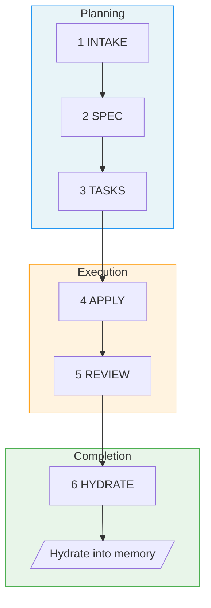

# Fab Kit

A specification-driven development workflow for AI agents. You define what to build, AI specs, implements, and reviews it — then hydrates what it learned back into your project's shared memory. The more you ship, the smarter it gets.

Fab Kit is a 6-stage pipeline that runs entirely as AI agent prompts. No CLI tools, no system dependencies. Copy it into your project and go.

## Parallel by Design

Describe a change, wait while AI works, review, describe the next one. Half your day is waiting.

Fab breaks this loop. Every change is a self-contained folder with its own spec, tasks, and status. Hand an entire batch to AI — each in its own git worktree — and start creating the next batch while it works. You're never waiting. AI is never idle.

```
  ██ = working    ░░ = idle

              One at a time
              ─────────────

  You    ██░░░░░░░░██░░░░░░░░██░░░░░░░░██░░░░░░░░
  AI     ░░████████░░████████░░████████░░████████░░

  Create, wait, review. Create, wait, review.
  More waiting than working.


              Assembly line
              ─────────────

  You    ██████░░█████████░██░█████████░██░░░░░░░░
  AI     ░░░░░░██████████░████████████░░████████░░

  Create a batch, hand off, create the next batch.
  Both always working.
```

Three properties make this possible — without any one, batching falls apart:

- **Self-contained change folders** — Each change has its own spec, tasks, and [`.status.yaml`](fab/.kit/templates/status.yaml). No shared state means zero conflicts between parallel changes.
- **Git worktree isolation** — Each change runs in its own worktree. Parallel AI sessions can't step on each other.
- **Resumable pipeline** — Every [stage](#the-6-stages) produces a persistent artifact. Interrupt anything, `/fab-continue` picks up from the last checkpoint.

And two properties keep it fast without cutting corners:

- **Stages that don't get skipped** — Intake, spec, tasks, apply, review, hydrate. The pipeline encodes discipline so the agent can't skip straight to code.
- **Fast-forward when confidence is high** — `/fab-ff` and `/fab-fff` compress the pipeline when the change is well-understood, without sacrificing structure when it isn't.

[How the assembly line works →](docs/specs/assembly-line.md)

## Shared Memory That Grows With Your Project

Most AI tools give each agent (or each developer) a private memory file. It helps that one session, then disappears. Fab takes a different approach: every completed change hydrates what it learned into `docs/memory/` — a structured, domain-organized knowledge base that's committed to git and shared with the entire team.

```
  ┌──────────┐    hydrate     ┌──────────────┐
  │ spec.md  │ ─────────────▶ │ docs/memory/ │
  └──────────┘                └──────┬───────┘
       ▲                             │
       │       context for next      │
       └──────── change ─────────────┘
```

This creates a flywheel:

- **Every change makes the next one better** — The pipeline's final stage merges requirements and design decisions from `spec.md` into memory files. Future changes load those files as context, so the AI starts with real knowledge of your system instead of guessing.
- **Team knowledge, not personal notes** — Memory files live in git. Every developer and every agent session reads the same source of truth. Onboarding a new teammate (human or AI) means cloning the repo.
- **Seeded from anywhere, grown by working** — `/docs-hydrate-memory` ingests existing documentation (Notion, Linear, local files) to bootstrap the knowledge base. From there, the pipeline keeps it current automatically.
- **Structured, not append-only** — Memory is organized by domain (`auth/`, `payments/`, `users/`) with navigable indexes. As it grows, `/docs-reorg-memory` can restructure it. `/docs-hydrate-specs` flows knowledge back into design specs.

The assembly line makes you faster. Shared memory makes you smarter — and the effect compounds with every change you ship.

## A Self-Correcting Pipeline

The 6 stages aren't just sequential — the pipeline catches its own mistakes.

Two mechanisms make this work:

- **Project constitution** — `fab/constitution.md` defines your project's architectural principles using MUST/SHOULD/MUST NOT rules. Every spec, every task breakdown, and every review checks against the constitution — not just the change's requirements. This prevents the AI from solving the right problem the wrong way.

- **Rework loops** — When review finds issues, it doesn't just report them. It loops back to the right stage:

  | Review finds | Rework path | What happens |
  |-------------|-------------|--------------|
  | Implementation bug | → apply | Unchecks failed tasks, re-runs them |
  | Missing/wrong tasks | → tasks | Adds or revises tasks, re-applies |
  | Requirements were wrong | → spec | Updates spec, regenerates tasks |

  `/fab-fff` handles this autonomously — up to 3 rework cycles before escalating to you.

The result: the pipeline doesn't just validate at the end. It fixes what it finds, looping until the implementation actually matches the spec and the constitution.

## Works With Any Agent

Fab's workflow logic is markdown files — not a CLI binary, not an SDK, not a plugin tied to one vendor. The skill definitions in `fab/.kit/skills/` are plain prompts that any AI agent can execute. Claude Code, Codex, Cursor, Windsurf — if it can read a markdown prompt, it can run Fab.

```
fab/.kit/skills/fab-new.md          # The source — agent-agnostic markdown
       │
       ├──▶ .claude/skills/fab-new/SKILL.md     # Claude Code (symlink)
       ├──▶ .codex/skills/fab-new/SKILL.md      # Codex (symlink)
       └──▶ .cursor/skills/fab-new/SKILL.md     # Cursor (symlink)
```

One source, multiple agents. Updating `fab/.kit/` updates every agent integration at once — no re-export, no per-tool configuration. The invocation prefix differs (`/fab-new` in Claude Code, `$fab-new` in Codex), but the skill content is identical.

This also means Fab is future-proof. When the next AI coding tool ships, you add symlinks and it works. No migration, no rewrite.

## Prerequisites

Install the following with [Homebrew](https://brew.sh/) (works on macOS and Linux):

```bash
brew install yq gh bats-core direnv
```

| Tool | Purpose |
|------|---------|
| [yq](https://github.com/mikefarah/yq) | YAML processing for status files and schemas |
| [gh](https://cli.github.com/) | GitHub CLI — used for installation and releases |
| [bats-core](https://github.com/bats-core/bats-core) | Bash test runner for kit validation |
| [direnv](https://direnv.net/) | Auto-loads `.envrc` to put fab scripts on PATH |

After installing `gh`, authenticate with `gh auth login`.

## Quick Start

### 1. Install

**From GitHub releases** (requires [gh CLI](https://cli.github.com/) with authentication):

```bash
mkdir -p fab
gh release download --repo wvrdz/fab-kit --pattern 'kit.tar.gz' --output - | tar xz -C fab/
```

Or from a local clone:

```bash
cp -r /path/to/fab-kit/fab/.kit ./fab/
```

### 2. Initialize

```bash
fab/.kit/scripts/fab-sync.sh            # creates directories, symlinks, .gitignore
direnv allow                            # approve .envrc (adds scripts to PATH)
```

Then open your AI agent and run:

```
/fab-setup    # Claude Code
$fab-setup    # Codex
```

### 3. Your first change

```
/fab-new Add a loading spinner to the submit button      # or $fab-new in Codex
```

Here's what happens:

1. The agent creates an `intake.md` capturing intent and scope, asking you clarifying questions
2. Run `/fab-continue` (`$fab-continue`) — generates a `spec.md` with requirements
3. Run `/fab-continue` — generates a `tasks.md` with an implementation checklist
4. Run `/fab-continue` — the agent implements the code, checking off tasks as it goes
5. Run `/fab-continue` — reviews the implementation against the spec
6. Run `/fab-continue` — hydrates learnings into project memory, then archive

At any point, run `/fab-status` (`$fab-status`) to see where you are.

For small, well-understood changes, `/fab-ff` (`$fab-ff`) fast-forwards through all planning stages at once, and `/fab-fff` (`$fab-fff`) runs the entire pipeline autonomously.

## The 6 Stages



| # | Stage | Purpose | Artifact |
|---|-------|---------|----------|
| 1 | **Intake** | Capture intent, scope, approach | `intake.md` |
| 2 | **Spec** | Define requirements | `spec.md` |
| 3 | **Tasks** | Break into implementation checklist | `tasks.md` + `checklist.md` |
| 4 | **Apply** | Execute the tasks | Code changes |
| 5 | **Review** | Validate against spec | Validation report |
| 6 | **Hydrate** | Complete and hydrate into memory | Memory updates |

## Command Quick Reference

> **Prefix:** Use `/fab-*` in Claude Code, `$fab-*` in Codex.

| Command | Purpose |
|---------|---------|
| `/fab-setup` | Bootstrap fab/ structure, manage config/constitution, apply migrations |
| `/fab-new <description>` | Start a new change |
| `/fab-continue` | Advance to next stage |
| `/fab-ff` | Fast-forward all planning stages |
| `/fab-fff` | Full autonomous pipeline (requires confidence >= 3.0) |
| `/fab-clarify` | Deepen current artifact before moving on |
| `/fab-status` | Check current progress |
| `/fab-switch` | Switch active change |
| `/fab-archive` | Archive a completed change |
| `/docs-hydrate-memory [sources...]` | Ingest external docs into memory |

## What's in the Box

```
fab/.kit/
├── VERSION          # Semver version string
├── skills/          # Markdown skill definitions for AI agents
├── templates/       # Artifact templates (intake, spec, tasks, checklist)
├── scripts/         # Shell utilities (setup, upgrade, release)
└── schemas/         # Workflow schema and validation
```

The kit provides the 6-stage workflow above. See [docs/specs/index.md](docs/specs/index.md) for the full specification.

## Updating

```bash
fab-upgrade.sh       # downloads latest kit, replaces fab/.kit/, repairs symlinks
```

If the upgrade reports a version mismatch, run `/fab-setup migrations` in your AI agent to apply migrations. Safe to re-run.

To repair symlinks and scaffold structure without downloading a new release (useful when developing fab-kit itself):

```bash
bash fab/.kit/scripts/fab-sync.sh
```

## Learn More

- **[The Assembly Line](docs/specs/assembly-line.md)** — batch scripts, Gantt charts, and the full numbers behind parallel development
- **[Design & Workflow Details](docs/specs/overview.md)** — principles, detailed stage descriptions, example workflows
- **[User Flow Diagrams](docs/specs/user-flow.md)** — visual maps of the full pipeline, shortcuts, rework paths, and state machine
- **[Full Command Reference](docs/specs/skills.md)** — detailed behavior for every `/fab-*` skill
- **[Glossary](docs/specs/glossary.md)** — all Fab terminology defined
- **[Contributing](CONTRIBUTING.md)** — developing, extending, and releasing Fab Kit
