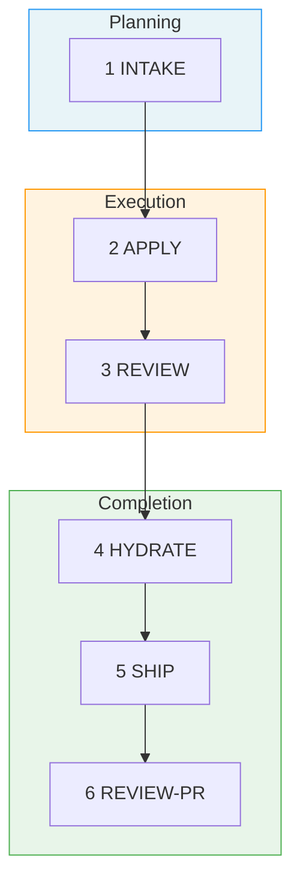

# Fab Workflow Specification

> **Fab** (fabricate) - A Specification-Driven Development workflow

## Design Principles

### 1. Pure Prompt Play
All workflow logic lives in markdown skill files that any AI agent can execute — no build steps, no runtime frameworks. The kit (skills, templates, migrations) is distributed via the system cache (`~/.fab-kit/versions/<version>/kit/`, managed by the `fab` binary from `brew install fab-kit`) and deployed into projects as `.claude/skills/` copies by `fab sync`.

### 2. Memory Is the Source of Truth
Code serves documentation, not the other way around. The memory files (`docs/memory/`) are the source of truth for what the system does and why it works the way it does.

### 3. Change Folder First
All work happens in change folders. Each change captures its requirements in `plan.md`'s `## Requirements` section (co-generated at apply entry), which get hydrated into memory files on completion.

### 4. Stage Visibility
Always know where you are. Each change folder has a `.status.yaml` manifest that tracks current stage and progress. The `.fab-status.yaml` symlink at repo root points to the active change's `.status.yaml`, providing instant access to whichever change is in flight — no scanning or guessing required. Run `/fab-status` for a quick check.

### 5. Skill-Based Interface
Use skills (not rigid commands) for better agent interoperability. Skills are more naturally invocable by AI agents.

### 6. Git-Optional
Fab tracks changes in directories, not branches. A change folder is the unit of identity — the same change can be worked on across multiple branches, worktrees, or even repos. When git is available, `/git-branch` creates or adopts a matching branch (and `/fab-new` creates one inline), but no branch information is stored in `.status.yaml`. The ship path is the deliberate exception: `/git-pr` commits, pushes, and creates the PR, and `/git-pr-review` processes feedback — both guarded by a branch-matches-change STOP. Fab never merges or deletes branches.

---

## Getting Started

For installation and setup, see the [Quick Start in the README](../../README.md#quick-start).

**Prerequisites**: An existing project directory (git repo recommended but not required) and an AI agent that supports skill definitions (e.g., Claude Code, Cursor, Windsurf).

After bootstrapping, use `/docs-hydrate-memory` to ingest existing documentation (Notion URLs, Linear URLs, local files) into `docs/memory/`. See [Skills Reference](skills.md#docs-hydrate-memory-sources) for details.

---

## The 6 Stages

Changes progress through 6 stages: `intake → apply → review → hydrate → ship → review-pr`. Intake is the only stage requiring human judgment (gated by the single intake confidence gate); everything after intake runs unattended unless review-rework exhausts or PR feedback arrives:



### Stage Details

| # | Stage | Purpose | Artifact | Includes |
|---|-------|---------|----------|----------|
| 1 | **Intake** | Intent, scope, approach | `intake.md` | Created by `/fab-new` (auto-activates) or `/fab-draft` (no activation) with adaptive SRAD-driven questioning. The sole confidence gate (flat 3.0) is evaluated here. Refine with `/fab-clarify` (intake-only) |
| 2 | **Apply** | Generate plan + execute | `plan.md` + code changes | Entry sub-step: co-generate `plan.md` with `## Requirements`, `## Tasks`, and `## Acceptance` sections from `intake.md` in one pass. Main sub-step: execute the unchecked tasks under `## Tasks`, run tests, mark `[x]` |
| 3 | **Review** | Validate via sub-agent | validation report | Single sub-agent review with prioritized findings (must-fix / should-fix / nice-to-have); it inspects items under `plan.md` `## Acceptance` against `## Requirements` and judges the diff on its own merits |
| 4 | **Hydrate** | Complete & hydrate | memory updates | Hydrate the plan's requirements into memory files |
| 5 | **Ship** | Commit, push, create PR | draft GitHub PR | `/git-pr` autonomously commits, pushes, and opens a draft PR (branch-matches-change guard; records the PR URL in `.status.yaml`) |
| 6 | **Review-PR** | Process PR feedback | fixes + replies | `/git-pr-review` requests/fetches reviews (Copilot or human), triages each comment as fix/defer/skip, applies fixes, posts replies |

### User Flow

For detailed visual maps of how commands connect — including shortcuts, rework paths, and the full state machine — see **[User Flow Diagrams](user-flow.md)**.

---

## Quick Reference

| Skill | Purpose | Creates |
|-------|---------|---------|
| `/fab-setup` | Bootstrap fab/ structure | `config.yaml`, `constitution.md`, `memory/`, deployed skill copies (idempotent) |
| `/docs-hydrate-memory [sources...]` | Ingest external sources into docs/memory/ | Updated `docs/memory/` with indexes |
| `/fab-new` | Start change (creates intake + activates) | `intake.md`, `.status.yaml` |
| `/fab-draft` | Create change intake without activating | `intake.md`, `.status.yaml` |
| `/fab-continue [<stage>]` | Next artifact (or reset to stage) | Next stage artifact |
| `/fab-ff` | Fast-forward through hydrate (intake-gated) | apply (plan + execute) + sub-agent review + hydrate |
| `/fab-fff` | Fast-forward-further through review-pr (confidence-gated) | All artifacts through hydrate + ship + review-pr |
| `/fab-clarify` | Deepen current artifact | Refined artifact (in place) |
| `/fab-continue` → apply | Implement | Code changes |
| `/fab-continue` → review | Validate (sub-agent) | Prioritized findings report |
| `/fab-continue` → hydrate | Complete & hydrate | Updated memory |
| `/fab-proceed` | Context-aware orchestrator — runs needed prefix steps (fab-new, fab-switch, git-branch), then delegates to `/fab-fff` | Full pipeline from conversation context |
| `/fab-adopt` | Adopt a completed off-pipeline change (OPEN/not-yet-created PR) — reconstruct intake + plan from the diff, run review (diff-only) → hydrate → ship → review-pr with apply `skipped` | Reconstructed intake + thin plan; pipeline entered late |
| `/git-pr` | Ship — commit, push, create draft PR | Draft PR, `ship` done |
| `/git-pr-review` | Process PR review comments (fix/defer/skip + replies) | Fix commits + replies, `review-pr` done |
| `/fab-archive` | Archive completed change | Folder moved to archive/ |
| `/fab-switch` | Change active change | Updated pointer file |
| `/fab-status` | Check progress | Status display |
| `/fab-discuss` | Prime agent with project context for discussion | — (read-only) |
| `/fab-operator` | Multi-agent coordination across tmux panes — monitoring, auto-answering, autopilot queues | — (coordination state) |
| `fab batch new` | Create changes from backlog items | Worktree + tmux tab per item |
| `fab batch switch` | Switch to existing changes | Worktree + tmux tab per change |
| `fab batch archive` | Archive completed changes | Folder(s) moved to archive/, backlog marked |

---

## Example Workflow

### Standard Flow
```bash
# 1. Start new change
/fab-new Add dark mode support with system preference detection

# 2. Intake generated with clarifying questions
# (answer questions, refine with /fab-clarify if needed; the intake gate is the only checkpoint)

# 3. Implement (apply co-generates plan.md, then runs tasks)
/fab-continue
# → Writes plan.md with ## Requirements, ## Tasks, and ## Acceptance sections (from intake.md)
# → Executes unchecked tasks, marks each [x]

# 4. Review
/fab-continue
# → Validates implementation, checks plan.md ## Acceptance items against ## Requirements

# 5. Hydrate
/fab-continue
# → Saves learnings into docs/memory/

# 6. Ship
/git-pr
# → Commits, pushes, creates a draft PR

# 7. Process PR feedback
/git-pr-review
# → Triages review comments, applies fixes, posts replies

# 8. Archive
/fab-archive
# → Moves change folder to archive/
```

### Fast Track (small changes)
```bash
/fab-new Add loading spinner to submit button
/fab-fff
# → Fast-forwards through apply (plan + execute), review, hydrate, ship, and PR review
```

---

## Further Reading

- [User Flow Diagrams](user-flow.md) — visual maps of the full pipeline, shortcuts, rework paths, and state machine
- [Architecture](architecture.md) — directory structure, config, conventions
- [Skills Reference](skills.md) — detailed behavior for each `/fab-*` skill
- [Templates](templates.md) — artifact formats and acceptance generation

