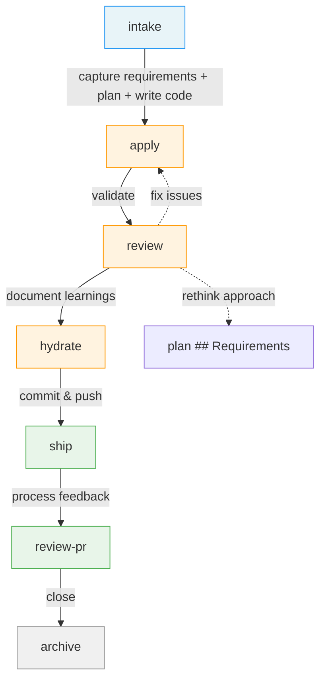
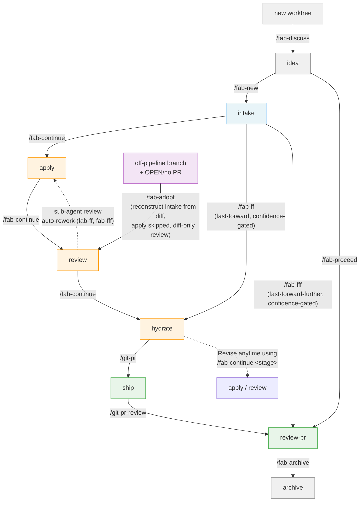
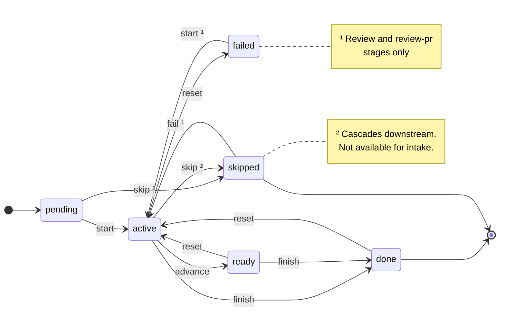

# User Flow Diagrams

> Visual maps of the Fab workflow — how commands connect and what each flow looks like in practice.

---

## 1. How Development Works Today

The stages every developer already follows — define what to build (intake), capture requirements + plan + code it (apply), review it, close it. Fab doesn't invent new stages; it gives each one a name and a place. Human judgment is frontloaded to intake; everything after runs unattended.

---

## 2. The Same Flow, With Fab

Each transition is now a `/fab-*` command. `/fab-ff` fast-forwards from intake through hydrate; `/fab-fff` fast-forwards further through ship and PR review. `/fab-archive` is a separate housekeeping step after the pipeline completes. `/fab-adopt` is the **alternate entry point** for work that bypassed the pipeline: a branch authored without fab (with an OPEN or not-yet-created PR) enters *late* — intake is reconstructed from the diff, **apply is `skipped`**, and review (diff-only) → hydrate → ship → review-pr run for real.

---

## 3. Change State Diagram

The complete state machine showing how a change progresses through all stages. Each stage can be in one of six states: `pending`, `active`, `ready`, `done`, `skipped`, or `failed` (review and review-pr only). The diagram shows normal forward flow, shortcuts, rework paths, and the commands that cause each transition.

```mermaid
stateDiagram-v2
    direction TB

    [*] --> intake: /fab-new
    [*] --> review: /fab-adopt (adopt off-pipeline change; intake reconstructed, apply skipped)

    intake --> apply: /fab-continue (co-generates plan.md, runs tasks)
    intake --> hydrate: /fab-ff (fast-forward, intake-gated)
    intake --> review_pr: /fab-fff (fast-forward-further, intake-gated)

    apply --> review: /fab-continue

    review --> hydrate: pass (all checks ✓)
    review --> apply: auto-rework (sub-agent, fab-ff/fab-fff)
    review --> earlier_stage: /fab-continue apply (manual)

    state "apply (revise requirements)" as earlier_stage

    hydrate --> ship: /git-pr
    ship --> review_pr: /git-pr-review
    review_pr --> [*]: /fab-archive

    state "review-pr" as review_pr

    note right of intake
        Created by /fab-new.
        Contains: goals, constraints.
        Confidence score calculated;
        /fab-clarify to improve.
        The single gate lives here.
    end note

    note right of apply
        Entry sub-step: co-generates plan.md
        (## Requirements from intake.md +
        ## Tasks + ## Acceptance).
        Tasks run in order;
        tests after each task;
        resumable (plan.md persists,
        markdown ✓ tracks progress).
    end note

    note right of review
        Sub-agent review:
        prioritized findings
        (must-fix / should-fix /
        nice-to-have).
        Auto-rework loop in
        fab-ff and fab-fff.
    end note

    note right of ship
        Commit, push, create PR
    end note

    %% Styles
    classDef planning fill:#e8f4f8,stroke:#2196F3,stroke-width:2px
    classDef execution fill:#fff3e0,stroke:#FF9800,stroke-width:2px
    classDef shipping fill:#e8f5e9,stroke:#4CAF50,stroke-width:2px
    classDef input fill:#f3e5f5,stroke:#9C27B0,stroke-width:2px

    class intake input
    class apply,review,hydrate execution
    class ship,review_pr shipping
```

---

## 4. Per-Stage State Machine

Section 3 shows which *stage* a change is at. This section shows how each individual stage transitions between *states*. Every stage tracks its own progress as one of: `pending`, `active`, `ready`, `done`, `skipped` (and `failed` for review and review-pr; `ready` is not an allowed state for ship or review-pr — `advance` is rejected there). The events that drive transitions are issued by `fab status`.

### Side-effects

| Event | Side-effect |
|-------|-------------|
| **finish** | If the next stage in the pipeline is `pending`, it is automatically set to `active` |
| **reset** | All downstream stages are cascaded to `pending` |
| **skip** | All downstream `pending` stages are cascaded to `skipped` |

Source of truth: the Go state machine — transitions and side-effects in [`src/go/fab/internal/status`](../../src/go/fab/internal/status/status.go), stage order and progress schema in [`src/go/fab/internal/statusfile`](../../src/go/fab/internal/statusfile/statusfile.go). (The former declarative `src/kit/schemas/workflow.yaml` was retired in 260612-c5tr — it had drifted to the pre-1.10.0 7-stage pipeline and nothing consumed it.)

---

## 5. Stage Coverage by Command

See [Stage Coverage by Command](../../README.md#stage-coverage-by-command) in the README.
